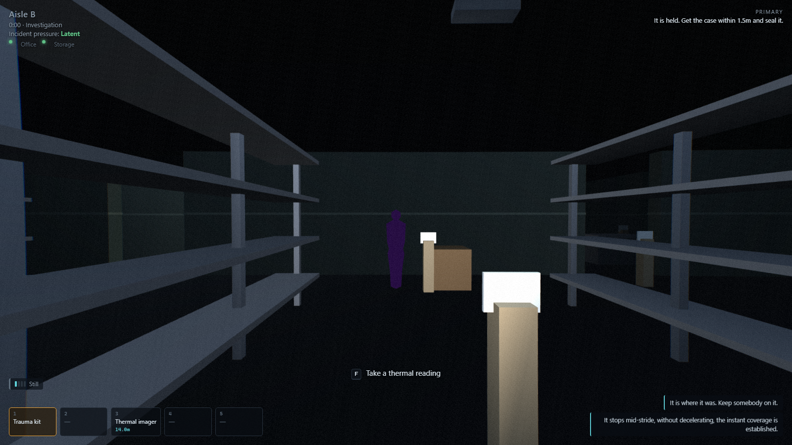

# Containment Detail — the browser build

**Play it: https://dumb-tony.github.io/ContainmentDetailWeb/**

A first-person containment operation. You are a Foundation field unit sent two levels
down into a cold store where a maintenance crew reported *"cold that moves"*. Two of the
three came back.

You do not kill it. You work out what it wants, build something that stops it, and put it
in a box while it is still trying to get past you.


## What is actually going on

One scalar field, sampled. `heat.temperatureAt(x, z)` is what the thermal imager paints,
what the anomaly's path test reads, and what decides whether a fence holds — there is no
second source of truth for either of them to drift from. Everything the game does falls
out of that one function and the anomaly's own rule: **it cannot cross a sustained heat
gradient above 40°C.**

- A **floodlight tripod** is a fence post because its own 40°C contour blocks the approach
  to itself. Nothing in the code special-cases "ignore floodlights" — it just cannot get
  there.
- The **transit case** runs its heater at 39°C. One degree under the threshold, two above
  a human being: it is the warmest thing on the floor the draught can still reach, so it
  is bait rather than a wall. Set a tripod down too close to it and the bait becomes a
  wall, and nothing comes.
- Heat sources **superpose**, so two tripods bridge a 4.2 m aisle that neither can span
  alone. The measured contour radii are printed by the test suite rather than remembered.
- The draught is a **cold mass**: it lowers the wall it leans on. A fence that was exactly
  good enough on the way in is not good enough at contact.
- The floor gets **colder** the longer you take, and a colder floor shrinks every contour
  you own. That is the clock, and you can feel it.

Two kinds of wall exist and they are different lists. Cold-store panel and closed freight
doors stop the draught; the steel racking in the aisles does not, and neither does
anything else you might reasonably expect to. That asymmetry is why the site's two-step
power puzzle matters — the office breaker is out on the bay wall, the storage breaker is
*inside the office*, and the freight door they bring up is the lane your lure needs.

The mission ends when the case is sealed, has held for thirty seconds, and is carried up
the stairs. It can be lost at any point in that sentence.

## Nine incidents, four buildings, eight things

The content unit is an **Incident Package**, not a map — an anomaly file holds rules and
nothing about where; a map holds geometry and nothing about what happened;
`content/incidents/` binds them and carries the spawn, the evidence lying about, and the
briefing. That is the only reason two operations can share a building.

**Cold that moves.** The graybox-draught: an invisible cold mass that hunts the warmest
thing it can reach and cannot cross a sustained 40 °C gradient. You fence it, bait it with
a case running one degree under the threshold, and seal it while it is held.

**The figure in aisle B.** The stillwater-figure does not move while it is observed. That
is the entire rule and the entire containment: you never fence it, you never stop looking
at it, and the difficulty is that looking is a resource you also need for carrying,
placing, powering and sealing. It reads at ambient on thermal, the breakers are
irrelevant, and its own capability browns out the cameras holding it — the fence you built
is the thing it feeds on.



It was a purple ball until recently, and so was every other anomaly in the build — the same
0.78 m icosahedron for all eight, including the one whose whole containment is a squad
looking at it. The tells were written and specific the entire time ("a figure at the limit
of the light, facing away, at the wrong scale for the distance") and the renderer read none
of them. `presence.form` names one of six shapes now, and every span comes out of a sentence
the file already said.

A squad that arrives with the first playbook finds every instinct wrong. That is the point
(GDD §15.2: the building is the constant, the incident is the variable).

**Ashlar House, ninth floor.** The mirror of that: the same draught, on a condemned
crosswall block with a drained district-heating gallery running its full width. Nineteen
of its fifty-seven walls carry the building and the other thirty-eight are plasterboard,
so the squad and the thing walk two different buildings over one footprint — you go the
long way round the flats while it crosses them in a straight line.

One floodlight's 40 °C contour measures **3.374 m** across. The cold store's aisles are
4.2 m, so a lane costs two posts and heat is the scarce thing. The gallery is **2.400 m**,
so one post closes the tube *across* and only its two ends are left: heat is cheap here
and the journey is what costs. A squad that learned "bring four tripods" has carried four
tripods up nine floors for nothing.

And the last lane cannot be closed with heat at all. The case reads 39.0 °C alone and
53.7 °C once the closing post is up, which takes the bait past the threshold and stops it
attracting anything — so the post is the *lid*, not the fence, and it goes down last. The
fire-stopping door is worth exactly one tripod. That exchange rate is the whole power
puzzle.

Neither the building nor the thing in it is the constant. You learn both, separately, and
neither answer transfers whole.

**The stocktake.** Eleven identical brass discs on the cold-store floor; five of them are
the anomaly. Nothing hunts you, there is no fence, and the failure state is arithmetic. The
tell is the heat field again, used as an *instrument* rather than a wall — each disc is a
four-degree sink, so superposition does the search gradient without a line of code deciding
it: the three in the office read 7.9 °C below ambient and are obvious from the doorway, the
singletons read 3.8 and have to be stood over.

Verification is the case, not a label. Log a real one and the count moves; log a mundane
one and the case takes it **silently** and the number does not. The game never says "that
was the wrong one" — noticing the silence is the mechanic. And the total is on a stocktake
sheet in the office, not on the HUD, so you can seal on three of five and find out at the
debrief.

**The caller.** In a condemned forest reserve, a thing that hunts *sound* and is restrained
by *silence*. Every other containment here is something you build; this one is something
you stop doing. You cannot make a quiet louder — you switch things off, put things down,
and crouch.

The lure is your own kit, which is the trap. A heater carries 22 m, a floodlight ballast
11, a power pack 7. On the cold-store floor those are the fence and the bait; here every
one is a beacon, and a squad running the draught playbook has built a perfect lure around
itself and switched it on. Two lures at once mask each other into unresolvable and it stops
in the wrong place.

Crouch stops being a way to be shorter. At two metres: 29.6 dB standing still, 35.1
crouch-walking, 48.0 walking, against a 46 dB threshold. Walk at a stilled caller and it is
running within a second. Crouch and you can get to arm's reach and close the case.

**What was left running.** The fourth operation on the cold-store floor, and the one that
punishes knowing it. A contractor went down on the Tuesday to replace a failed heater and
did not come back up. He is at the north end of the west run and he was warm when they
found him on the Wednesday.

It does not move at all. It takes whatever warm object comes within a metre and a half of
it, and it will not be watched while it holds one. So the squad arrives with three
operations' worth of correct knowledge about this floor and every piece of it is aimed at
the wrong thing: nothing here is fenced by anything, ever; a camera left pointing anywhere
near the case makes the whole operation stutter on a three-and-a-half second cycle and
burns five of the case's twelve minutes; and restoring the mains does exactly one thing,
which is make the floor bright enough to look at things by. Looking at things is the
failure mode.

It reads at ambient on every instrument in the manifest, in every state, from every
distance. An imager pointed at it shows the floor. The only habit that survives is the one
nobody thinks of as a habit: get the case out of cargo and get it powered first.

**Flat 5.** The second operation on Ashlar's ninth floor, and the inversion of what the
first one taught. The gallery draught is a journey and a fence; this never leaves one flat
and there is nothing to build.

Ashlar's argument is that nineteen of fifty-seven walls are real and thirty-eight are not.
The draught incident is about the thirty-eight being *useless* — they stop the squad and
not the thing. This one is about the thirty-eight being *useful*, for a reason nobody has
needed yet: a sightline is cast against all fifty-seven, so eleven millimetres of
plasterboard breaks a line of sight exactly as completely as a concrete crosswall does. On
this floor a wall that stops nothing can hide you from something, and hiding is the whole
containment.

Watching it holds it rigid, instantly, from any state. Slackening takes five continuous
seconds of nobody and no camera seeing it. So the climax is one operative standing beside
the case with their back to something they cannot see, pressing a verb they cannot aim —
and a squad that deploys a camera out of habit holds it rigid for that camera's whole
battery with no seal verb available at all.

Same sense as the figure in aisle B, opposite sign. That is the argument the closed
vocabulary exists to make: a key names a quantity, and the content decides what it means.

**The ballast.** A three-man gang lifting the earth mat out of a decommissioned 33 kV
switching compound stopped after two days: stone they had barrowed out to the skip was back
in the yard by the morning. This is a **fourth environment family** — outdoors and
industrial, which is neither the cold store nor the reserve — and a seventh procedure family:
containment by **deprivation**, performed while the thing is walking at you.

Every family before it is about the squad's own state — a gradient you hold, a cone of
attention you keep pointed, an account you keep, a silence you maintain. This one is about
the *site's*. The thing has hold of a set of objects lying about the yard, and until those
objects are somewhere else it cannot be lifted at all. The work is not building anything and
not stopping anything: it is stripping the floor, while something that does not stop is
crossing it.

It is not the stocktake with a hunter bolted on. The tally is an accounting problem in which
nothing hunts you and the count is the unknown; here the count is on the ground in front of
you and the scarce thing is the minutes you have to move it.

**And it can be put back down**, which for a long time it could not. It sat in that compound
for nine days before anybody called it in, and the state machine had no way back to the state
those nine days were spent in: one operative straying inside eleven metres in the first
minute escalated the whole yard permanently. It settles again after twenty seconds with
nothing warm inside eleven metres — but `no-heat-within` measures from the *anomaly*, and the
anomaly is walking at 0.8 m/s, so twenty seconds of clearance actually costs **27 m of
standing gap**. Measured: an operative who wakes it at 9 m and then walks the entire compound
to the gate buys 15.8 m, stands still, and watches it close to zero.

The route that works is the decoy. Put a floodlight between the squad and the bed, withdraw,
and it takes the 60 °C lamp over a 37 °C person and sits on it; when the cell dies with
nobody within eleven metres, it beds down twenty seconds later. And the cell dies fast — 84 s
of a 330 s battery — because `bleeds-cells` drains power at 4.5 m in exactly the three states
it hunts in, so **the thing you lured onto the lamp is standing on the lamp eating it.**
Nobody wrote that down anywhere; it falls out of two independent content entries agreeing.

**The toll.** A night attendant on level 2 was found sitting on the floor beside a drainage
gully with cold burns to both hands and no memory of the previous twenty minutes. He was not
trapped and nothing was holding him. He says he crouched down to look at something, that it
was not unpleasant, and that he did not think of getting up. The man who found him pulled
him back three feet and it stopped the moment he was clear.

An eighth family, and the one with no equipment in it: containment **paid for**, in the
operatives' own bodies, on a clock, and then taken back at the last moment. Every other
family spends cargo, position, attention or noise. This one has no currency but warmth, and
the squad brings only three sources of it onto the floor.

It is the fifth incident on cold storage level 2, which is §15.2's whole argument in one
column: by the fifth trip down the same stair you arrive with four operations' worth of
correct knowledge about that floor and the job is working out which of it still applies.

That is GDD §26.2's three procedure families — perception, auditory, distributed-object —
plus the heat fence the build started with, and then four more: attention as a poison,
sequence, deprivation under pressure, and a toll paid in warmth. Eight anomalies over four
buildings, and the worst verb-set overlap between any pair involving the newest two is 50%.

**The engine does not know what either of them is called.** States, triggers, capabilities
and field disturbance are all read from content, through a closed vocabulary of senses and
effect verbs in `src/sim/senses.js`. A JSON key may name a *quantity*, never an *operator*.
The suite proves it by renaming every state in the shipped anomaly to `q0`–`q4` and running
the whole sequence through anyway.

**And it does not know what they are evidence *of*, either.** The hypothesis board — the
half of the tablet where you mark a rule supported or excluded — was seven claims written
for the draught, frozen in code, and shown for every anomaly. Measured: it cited two of the
lodger's fourteen observations, and hung four of the *draught's* claims on them. A board
that asserts something false about the thing you are standing in front of is worse than no
board. Claims are content now, one set per anomaly, and the loader refuses a claim that
names an observation its own anomaly does not have.

The same went for discovery. Three evidence ids could be *earned* by doing rather than
found lying about — `thermal-void`, `frost-boundary`, `battery-drain` — because those three
were spelled into the engine. Anything a designer wanted the squad to work out had to
borrow one of those three names. There is a closed vocabulary of three operators now
(`instrument-held-on-it`, `held-at-a-barrier`, `powered-kit-draining`); content names the
operator and supplies the metres and the seconds, and the id it hangs on is the designer's.
No evidence id appears anywhere in `game.js`, and the suite fails the build if one comes
back.

## The site

Between operations you are at Regional Site 19: a mission board, an armory counter, an
archive, a research station and a containment corridor that lists what you are holding by
its operational history rather than as a trophy. Progression grants **options, context and
efficiency** — never damage, never immunity (GDD §12.1). Equipment upgrades are sidegrades;
a new variant never makes the old tool irrelevant.

Failure is recoverable and never profitable. A failed operation still yields research for
valid observations, and the site can always fund one more attempt — but leaving your kit on
the floor costs you, with the departments that care about kit.

## Every sentence in one place

The build was monolingual, and every sentence was spelled into the file that printed it —
across eighteen source files. `src/core/i18n.js` and `content/locales/` are the other half
of §23 Milestone 5's "accessibility and localization pass", and they run on one rule:

> **A key names a message, never a fragment.**

`t('hud.noise.walking')` is a message. `t('hud.noise.') + gait` is a sentence assembled at
runtime, and runtime assembly is what breaks in every language that is not English — word
order moves, adjectives agree, plurals are not two-valued. Interpolation is allowed;
concatenation is not. It is the same argument `sim/senses.js` makes about content, one layer
up: a key names a *whole thing said*, never a piece of one.

`n === 1 ? '' : 's'` is not a plural rule either. It is English's, written out, and it is
wrong in Polish before you reach a second language. `Intl.PluralRules` already knows; the
message file authors the categories.

**A pseudolocale, because an extraction pass is never finished and the way you find out is
not by reading the diff.** `?locale=pseudo` accents every message and pads it 30%, so
anything still hard-coded is the only unaccented text on screen and any layout that fits
English only breaks visibly. It found two things a grep could not: `PHASE.ARRIVAL` and
`CONFIG.pressure.stageNames` were engine *ids* that were also *labels*, arriving through an
interpolation from a constant three modules away. The HUD read `⟦Încîdént préssûré: Latent⟧`.

`en-US` ships deliberately **partial** — eight messages, the ones where American English
differs — because the fallback path is the one piece of localization machinery a complete
file can never test, and a fallback that is never exercised is broken the first time
somebody ships a translation that is 80% done. It does not convert the units: the threshold
is 40 °C and the seal radius is 1.5 m, and those are *rules* that every other surface prints.

## Certification, which teaches a method and never an answer

§18.6 puts training in three layers and then adds the sentence that rules out almost every
tutorial this kind of game ships: *"Tutorials teach the reasoning pattern, not the solution
to later anomalies."*

So none of the nine competencies names a rule, a threshold, a distance or an anomaly. Every
one is a verb you perform — logged two observations, marked a claim, *revised a view you had
already taken*, wrote down what you were going to do before doing it. The loader **refuses**
a competency whose text contains a figure, and the suite proves the refusal by handing it
"a sustained gradient above 40C stops it" and requiring a throw.

It certifies what was **done**, not what was read: each competency watches an event on the
analytics bus, there is no acknowledgement step, and the suite asserts that no method on the
class can award one. So you can earn the whole certificate during ordinary play without ever
opening a training screen — which is correct, not a loophole. And it gates nothing: §12.1
grants options, never permission.

## The score, which is not a distance function

§17.5 is one paragraph and every clause in it is a constraint: *"Music is sparse during
investigation. It responds to comprehension and procedural commitment rather than merely
enemy proximity. Containment music supports rhythm without masking callouts. The base uses
low, functional ambience and restrained motifs tied to site growth."*

The `music` bus was built with the other five and had nothing on it, with a comment saying
so. It has four layers now, and the interesting thing about them is what they are **not**
allowed to know.

Every horror score is a distance function. Writing one here would have been two lines — the
mix layer computes `near` on its first line — and it would have sounded completely correct,
which is exactly why nothing would ever have caught it. So `scoreFor` takes no position and
no anomaly state; they are not in its argument, and the suite greps the function's code
(comments stripped) to keep them out. What it reads instead is what the squad has **worked
out** and what they have **decided to do about it**:

- **bed** — always, and almost inaudible. Sparse is a floor, not a silence.
- **reading** — comprehension: how much of the board they have taken a position on, times
  how much of that position is carried by evidence they actually hold. **The product, not
  the sum** — a board full of guesses is not comprehension, and neither is a satchel nobody
  read. Both are silent, and the suite asserts both.
- **intent** — absent until a procedure is committed, then present. A decision does not fade
  in. A *revision* retunes the interval rather than raising it: the second plan is a second
  idea, not more of the first.
- **custody** — the rhythm layer, and the loudest thing in the score, because the climax of
  this game is a box holding.

At its loudest the whole score is 0.385 across four layers — under a third of the anomaly's
own voice, because it is a score and not a cue. And "without masking callouts" is a rule
rather than a mixing note: a live caption or a ping in the last two seconds ducks the entire
bus to **35%**, fast in and slow out, so a call cuts through on the syllable and the score
does not come back up under the second half of the sentence.

Measured in a real `AudioContext` rather than only as a pure function: four oscillators on
the `music` bus, ramping to 0.045 / 0.115 / 0.085 / 0.140, and every one of them at 35% of
that a second after a call lands.

## Accessibility

Full remapping with browser-reserved keys refused, hold-vs-toggle resolved at the source,
captions for every audio cue, colour-vision presets with shape redundancy, adjustable
FOV/shake/bob/blur/grain/distortion, photosensitivity-safe mode that clamps rather than
recording a preference, five volume sliders, UI scale, and difficulty assists. `O` opens it.

GDD §19.2 is the design constraint, not the menu: no required rule may depend on fine
colour discrimination, stereo hearing, a microphone, small text or flashing imagery.

Applying that constraint to the caller found something bigger than a menu item. The sound
field is fully simulated — four levels off speed, wall loss, occluders, masking, and an
instrument built to read it — and *nothing showed it*. Not the HUD, and not the mix either:
there is no footstep cue, so a player wearing headphones knew exactly as much as one with
the sound off. On the reserve, where the thing hunts noise and is stopped by silence, the
game's central quantity was legible only to the anomaly. That is §8.2 before it is §19.2 —
every rule has to be observable. There is a four-band readout now, and it carries no
decibel figure and no threshold mark, because the level the caller wakes at is a rule you
are supposed to learn from evidence rather than read off your own HUD.

Two rules the suite enforces rather than trusting:

**An assist widens a window; it never moves a rule.** `procedureTiming` stretches the gap
between one contact and the next, and the ninety seconds you have while down. Reach, what
a contact applies, the 40 °C threshold and the thirty seconds of custody read *identically*
at 1.0 and at 2.0. It is also scoped to the operative, not the session — the host
simulates everybody's clock, so the obvious build would take the assist away from anyone
who joins a friend's game.

**The navigation aid draws the building, never the incident.** Walls, open doors, the
extraction, your squad. Not the anomaly: finding it is most of the game and the imager is
how you find it. The test reads the canvas pixels — nothing at all where the anomaly
stands, and the extraction drawn in the same pass so the test can prove it is looking at
an image rather than a blank.

An accessibility control that silently does nothing is worse than one that is absent,
because a player who needs it will believe they have already tried it. So consumption is
asserted, not presence.

**Controller.** Nothing above `input.js` has ever asked about a key — the whole build asks
for *actions* — so a pad button is a synthetic code through the same path, and it inherits
the binding table, the conflict checker, hold-versus-toggle and remapping for free. The
sticks are analog, with a squared response after a radial deadzone: half deflection reads
0.179, so the first half of the travel is fine control, which is what makes placing a
tripod in a 1.5 m doorway possible on a pad. Look is a rate times the frame's duration, not
a delta, so turn speed is not a function of frame rate.

## Does the game do what the document says

`GAME_BIBLE/GDD.md` §27.2 lists ten criteria an anomaly must meet to be release-ready and
§26.4 lists eight metrics the slice is judged on. Section AC runs them as a scorecard across
every anomaly in the build.

The five that need external testers report **OPEN**. A suite that quietly asserted `true`
for "80% can use the evidence board without facilitator help" would be worse than one that
omitted it — it would look like the criterion had been met. Median mission duration reports
OPEN too, with the bot times printed as the lower bound they are: a bot does not search or
hesitate.

It has found real gaps rather than confirming what was already believed. §27.2 asks for at
least two evidence paths per required rule; measured, the build had **3 of 12**. With one
path a squad that walks past a single pickup can never learn that rule — not "finds it
harder", cannot — which fails Pillar 1's design test outright. It is 25 of 25 now across
six anomalies.

And then the same check found itself counting the wrong denominator. A squad does not play
an anomaly, it plays an *incident package*, and a package places only the subset of an
anomaly's observations that makes sense on its floor — the draught ships twelve and Ashlar
places seven, because the other five are cold-store fiction and a chart recorder on a plant
wall does not exist in a condemned flat block. On that denominator it was **24 of 30**, with
five of the draught's rules carrying exactly one path on the floor a squad was standing on.
Reported as a pass by a check that was looking at the anomaly file instead of the operation.

## One to five operatives

Host a room, share the five-character code, and everyone connects browser to browser over
WebRTC. No account, no server, no lobby list. A public broker introduces the two machines
and then carries nothing — every command and every snapshot goes peer to peer.

**The host's browser is the mission.** A client sends intent and draws snapshots and steps
nothing at all, so it cannot disagree about whether custody was established. It predicts
its own feet for responsiveness and blends toward the host's answer; past 1.2 m it snaps,
because smoothing that far is a slow lie. A client that teleports itself is simply
overwritten on the next snapshot.

**The squad's channel is not voice.** GDD §11.3 lists voice chat first and §19.2 says no
required rule may depend on a microphone or on stereo hearing. Those two are only
compatible if the *primary* channel is the one that needs neither, so what exists is a
ping-and-phrase wheel on `Z`: ten phrases the loop actually requires — *it is here*, *hold,
## The lobby, and what it is honest about

Verified on the deployed build, 2026-08-23, in two browsers against the real broker — and
verified again after the page grew a Content-Security-Policy, because a `connect-src` that
gets the broker wrong breaks the session and nothing else: the
host opens room **A88QJ** and reports *"room A88QJ — waiting"*; a second machine joins by
code, is issued seat **p2**, and its typed callsign appears on the host's roster as
*"Vasquez joined"*; the client then holds the host's authoritative positions for both
operatives, which is a full snapshot having crossed the wire. On leave, the host's roster
drops back to one seat and the room closes. That is the whole join path — broker, WebRTC,
seat allocation, callsign, snapshot, teardown — on the URL at the top of this file rather
than on a loopback.

Host a room and share a five-character code, a **room name** your squad already agreed on, or
put it on a **shared list** so a stranger can find you. There is no game server — the
transport is the public PeerJS broker — so each of the three ships with its own limits
printed beside it. A room name is deterministic on every machine, which is what makes it work
and also means the namespace is the whole broker: the field tells you whether the word you
typed is *guessable*, *shared* or *unlikely*. The shared list is a **volunteer directory**
held by whichever browser claimed it first; it lives in a player's tab, dies with it, and
every row is an unverified claim carrying its own age. No callsign ever goes on it.

One thing on that screen is a fact rather than a report: **probing a room** is a real connect
and hang-up, and the CSS gives it the only bright colour in the block.

The host can **remove a seat**, authoritatively — the seat leaves the machine that runs the
mission, so a client ignoring the message is talking to nobody. Their kit goes back to the
vehicle and a sealed transit case is put down where they stood, the same rule a dropped
connection already obeyed. The block is keyed on the **resume token** and checked *before*
the resume path, because a removed griefer holds a perfectly valid token for the seat they
were thrown out of. A removal can be undone; readmission is a fresh seat and not a rewind,
and the removal stays on the record.

Moderation needs a callsign and §21.2 forbids free text on the analytics bus, so those are
**two different logs** and the mistake would be one: the moderation record lives on the
host's machine, in memory, bounded, and never in storage.

Measured: 155 bytes per operative on the wire and 85 per deployable, flat rather than
quadratic; **454 kbit/s of host uplink with a full squad** at twelve snapshots a second. At
512 kbit/s it is usable and already noticeable; at 192 kbit/s the backlog is unbounded and
the worst message is 11.6 seconds late. The limit on squad size is a household uplink, not a
constant.

Those come from a ten-second run, and a burst figure is a claim about a burst. So a full
squad is now also held open for **four simulated minutes** — five seats, every one sending
intent at 60 Hz and a discrete action every two seconds — and sampled every thirty seconds.
The host's uplink reads 51.74 kB/s in the first window and 51.54 in the last, the squad's
11.70 against 11.71, message rates 50/s down and 242/s up throughout. **423 kbit/s
sustained, inside the same band the ten-second run asserts**, which is the only thing that
makes the ten-second run worth quoting.

Four structures were larger at the end than at the start, all of them things a four-minute
mission is supposed to accumulate, and none past 512 entries. And the check nobody had run
in the other direction: **four minutes of ordinary play by four operatives is rate-limited
exactly zero times.** A limiter is normally tested by flooding it, which proves it stops an
attacker and says nothing about whether it stops a player — and a defence that costs the
people it defends is a bug wearing a security argument. One seat flooding drains its own
bucket to 0.2 tokens while the other three sit at 28.4 of 30, because the bucket is keyed on
the seat; three seconds of not flooding buys it back to 29.0, so a flood is a pause and not
a ban.

leave that alone*, *something to log here*, *set up here*, *bring kit here*, *I have this
one*, *in position*, *on me*, *keep this in view*, *I am in trouble*. No greetings, no
emotes. A squad with no microphones between them can run a whole operation on it, and a
squad on voice still gets a marker on the floor instead of "over there, no, the OTHER one".

Every call is host-decided. The client sends the phrase and where it aimed and **does not
send who it is** — the host stamps the seat the link is in, so putting a callout on the
board under somebody else's name is impossible by construction rather than by validation.
You cannot mark what you cannot see, or anything over thirty metres away. Markers expire:
*it is here* lasts six seconds, because it walks, and a nine-second-old marker points at
where it was. Lose your radio and your markers go with it.

A second operative changes the simulation, not just the roster:

- **Every one of them is a heat source**, so a squad is several lures. The draught takes
  whichever it can actually reach — not whoever happens to be player one.
- **A second serious contact puts you down, not dead**, on a ninety-second clock. A
  teammate with a trauma kit gets the rescue prompt above everything but the seal. Alone,
  nobody comes.
- **A tripod is a long item**, so each of you carries one at a time. A fence that takes
  three trips solo takes one with three people.
- **Two on the case** move it at 95% pace; one drags it at 75%. Never gated — solo works.
- Somebody can watch the imager while somebody else has both hands full. There is one
  imager in the cargo budget, so that is a decision.

Joining is open until the squad commits to a procedure. After that the operation is
running and the door is shut. Lose your connection and your seat is held: your kit stays
yours, your operative stands still rather than wandering off, and a resume token puts you
back in the same body. If you were carrying custody when your radio died, the case is set
down where you stood rather than leaving the floor with you.

## Playing it with friends

Open the link, click **Deploy solo**, pick your kit, click **Deploy**, then click the screen
to take control. That is the whole solo path: two buttons and a click.

To play together: click **Form a squad** instead. Open the room, and next to the
five-character code there is an **invite link with the code already in it** — the button
copies it. Send it to a friend. When they click it, the page puts the code in for them and
joins: they land on your roster having typed nothing. Everybody clicks **Report ready**, the
host clicks **Take the operation**, picks the squad's kit, and deploys — every other seat's
lobby closes itself the moment that happens.

This flow is not assumed to work; it is *played*, headlessly, by `tools/playtest.js` — real
clicks on the real buttons, real key events into the real input path, the canvas photographed
at every step. It exists because 1,994 green assertions coexisted with an unplayable game:
every suite drove the simulation through its seams, and nothing had ever clicked "Take the
operation" to find that it led back to itself, through a page reload, into a lobby whose
deploy button sat disabled behind a ready-gate a solo player could never want. The driver
measured that wall (four clicks to a dead end), and now asserts its absence — 21 checks from
"the board offers the real choice" to "the friend holds a two-operative world".

## Controls

| | |
|---|---|
| `W A S D` | move · `Shift` sprint · `Ctrl` crouch |
| `F` | the context verb — it says what it will do before you press it |
| `E` | use or deploy what is in hand |
| `1`–`5` | select a slot |
| `Q` | thermal imager on/off |
| `Tab` | field tablet: evidence log, hypothesis board, procedure planner |
| `Z` (hold) | squad comms — the wheel picks the phrase, the mouse aims it |
| `O` | settings, remapping, accessibility |
| `Esc` | release the mouse |

Click the page to take the mouse. Two belt slots, two general, one long — a floodlight
tripod is the only thing that fits the long slot, so you carry them one at a time and the
walk back to the vehicle is part of the wager.

## Running it locally

Serving over http is required, not a convenience: the game is ES modules and browsers
refuse module loads on `file://`.

```bash
powershell -ExecutionPolicy Bypass -File tools/serve.ps1
```

It scans ports 8401–8410 and prints the one it got. Read that line — several projects on
this machine run the same server.

## The policy, and what it is allowed to be strict about

The page carries a Content-Security-Policy in a meta tag -- Pages serves static files and
cannot set a header, which costs `frame-ancestors` and is why that directive is absent rather
than written down and ignored. `script-src` is `self` alone: no CDN, no inline, and **no**
`unsafe-eval`, which is safe rather than hopeful because neither vendored library contains
`eval(`, `new Function` or `Function(` -- counted, all three patterns, both files. The one
directive it does not get to be strict about is `style-src`, which needs `unsafe-inline` for
one stylesheet and four UI modules that build `style="..."`; saying so beats pretending
otherwise.

It broke three things on the way in and all three were right to break. A suite that drives
`sw.js` through `new Function` died, because the harness works by copying this page -- so the
harness page drops the policy and `boot-tests.js` became the only place it is in force, which
is the honest arrangement rather than loosening a product policy to keep a test alive. And
two hygiene checks flagged `0.peerjs.com` appearing in `index.html`, correctly, until they
were taught the distinction the policy turns on: **a host in a `connect-src` allow-list is a
restriction, not a reach.** A check that fails on one teaches the reader to delete it.

## Offline, without ever serving a stale build

The deployed page installs and plays with no network. That is normally in tension with
push-is-the-deploy, and the tension is the whole design: the usual recipe,
`caches.match(request).then(hit => hit || fetch(request))`, would end this repo's deploy
model with no red light anywhere. `tools/verify-live.ps1` would keep passing, because the URL
genuinely *is* serving the new commit — and a returning player would keep yesterday's build
for ever, because their browser never asks. The only person who could see it is the one who
cannot report it.

So the worker is **network-first in every case**. Every GET goes to the network, and if the
origin answers at all — 200, 304, even 404 — those bytes go to the page and the cache is not
consulted. The cache is read in exactly two situations: `fetch` rejected, or the origin
returned 5xx. Neither is a case where a fresher build exists and the player is being denied
it. The property worth stating plainly is that **this worker cannot make a page staler than
no worker at all.**

One cache per build, named for the `cd-build` stamp, with a completion sentinel written
*last* — so two builds never mix, and a half-written cache is never read from. `sw.js` is
byte-identical across deploys and the build id is data, so a new build raises no waiting
worker and no "new version available" prompt. The update is invisible.

Measured on the live site, 2026-08-23, by opening the deployed URL and reading
`caches.keys()`: `cd-build-f235436-2026-08-23T15-13-53-04-00`, holding **74 files and the
`__cd-complete` sentinel** — 40 under `src/`, 26 under `content/`, 6 assets, `index.html`,
`manifest.webmanifest`, three.js and PeerJS both in, and `sw.js` itself correctly absent.
Exactly the 74 the platform suite derives from the module graph rather than from a list.

Worth knowing if you go looking: the worker does **not** register over `http://localhost` in
every browser context, and `main.js` swallows the failure by design, so a page that never
goes offline looks exactly like one that does. The deployed URL is the only place the answer
is real.

## Tests

The harness is a browser, because the thing under test needs one: WebGL, `AudioContext`,
`localStorage`, `CacheStorage`, a service worker, `Intl.PluralRules` and the real module
loader are not things to stub. Node is used for exactly one thing here — `node --check` as a
40 ms syntax gate before a suite is worth starting.

```bash
powershell -ExecutionPolicy Bypass -File tools/run-tests.ps1
```

That runs every `tools/*-tests.js` — each in its own browser, on its own port, against its
own scratch page — and sums them. Slower than one page, and the only version whose result
means anything while several people are editing at once: one suite cannot leave state for
the next, a suite that hangs cannot take the others with it, and a suite that produces no
result block at all counts as a **failure** rather than as zero assertions and no problem.
A crashed page reporting green is the failure mode the whole harness exists to avoid.

**1,994 assertions across twelve suites, all headless.** The twelve are the milestone-0 suite
(everything true of *every* package), the content suite (the numbers that make one incident
the incident it is), the net suite, the tablet suite, and six that arrived with the
milestones they check: licensing and rollback, localization, onboarding, telemetry,
platform, security and load — plus one that does nothing but start the game.

That last one exists because nothing else did. Ten suites and 1,946 assertions all built a
world the same way — `loadContent()`, then `new Game(...)` — which is the right shape for
testing rules and means **`src/main.js` was covered by nothing at all.** It is not a thin
wrapper: it installs the crash boundary, resolves a locale and awaits a message table, reads
`?incident=`, constructs a WebGL renderer, an audio graph, a Progression against real
storage, a lobby and a net session, and registers a service worker. Every one of those is a
way for a build to be broken for a player while every suite stays green, and two of them were
added during this session. `boot-tests.js` starts all nine incidents in real iframes and asks
the page what it became: four buildings, eight anomalies, no crash banner, `__CD` whole, and
an incident that does not exist **refusing in words** rather than sitting on "Loading the
site" for ever — because a page that hung and a page that stopped look identical to the
person in front of it.

Section I is the one that matters: it plays a complete
solo containment through the same interfaces a keyboard reaches — walks to the vehicle,
takes kit, throws breakers, opens doors, baits, fences, seals, waits out custody and
carries the case to the stairs. No teleports and no direct state writes, because testing
the simulation is not testing the game. Sections C and E print measured numbers rather
than asserting remembered ones.

Section M runs a whole three-operative session through the real encode/decode over a
loopback link — join, intent, snapshot, refusal, the squad cap, a version mismatch, a
drop, a reconnect, the join gate, custody being put down rather than carried offline by
somebody whose radio died — with no WebRTC in sight. What a loopback *cannot* prove was
checked in two real browsers on the real broker, and that is where the notice-feed bug
was found: a refusal the host sent and the client's next snapshot destroyed.

`tools/soak.ps1` is the third instrument: nine incidents, thirty simulated minutes, five
operatives, and **124 counters discovered by walking the Game rather than listed**, plus wire,
GPU and DOM probes. It found the one list in the build with no cap — `anomaly.transitions`,
which the debrief renders in full — and then found two more that were bounded and one that
was a number gaining a digit. It corrected itself against measurement four times: a
four-minute run called the 256-entry event ring unbounded, a per-frame gauge is not a
counter, a step is not a slope, and a byte count of a single number is too small for any
fraction to mean anything. **It passes now: nothing was still growing at the end, on any of
nine incidents.**

`tools/licence-audit.ps1` answers §25 from the repo rather than from memory — third-party
files against what `NOTICE.md` claims, every file that reaches the network, every content
file's licensing position, and anything with no provenance at all. It found two anomaly files
carrying a bare `licensingRecordId: null` where the other six carry a sentence saying what
the null *means*, which is the difference between a decision and a forgotten field.

Section K is the hygiene pass, and one of its rules earns its keep more than the others:
**a CONFIG value that nothing reads fails the build.** It found ten dead constants in a
single run — three engine rules left over from the Unity port that are content here, five
battery lives sitting beside the real ones in `items.json` and quietly disagreeing with
them, a `lightReliefRadiusM: 4.5` next to a hard-coded 6.5 for the same radius, and an RTT
budget under a correct comment about a rule the content already enforces per trigger. A
number in a config file is a promise that changing it changes the game, and ten of them
were lying.

That rule has a bigger sibling now, because the same question asked of *content* found far
more. 199 distinct JSON keys across `content/`, checked against all 25 files in `src/`:
**seventeen were read by no engine file and asserted by nothing.** Some were documentation
and fine. The rest were not, and each one was a field that looked like a rule and was a
comment — a `drain-power` capability that drained batteries whether or not it was authored,
a `hunts` that was ignored, a `blockedBy` that was overridden, a `thresholdCelsius` the heat
field never saw, a `cellRequirement` that let a thermal negative be filed in a locker, a
`concurrentRoles` no procedure was checked against.

Three more of the same shape were the engine knowing one anomaly by name: the custody
escape, the target chooser and the audio mix all switched on `graybox-draught`'s state ids,
so five of six anomalies fell through a `default:` and came out silent, unfenced, or in the
wrong state. Section K greps for those three words now. And three instruments were
simulated and connected to nothing — the sound field with no readout, the directional
microphone with no screen, and every anomaly's body on the thermal layer alone, so
`stillwater-figure` could not be seen by the squad whose whole job is looking at it.

`tools/bench.ps1` is the other half, because the suite asserts *work* — how many occluder
sweeps, how many samples — and says nothing about milliseconds. It replaces `main.js` so
nothing competes for the CPU being measured, keeps the real GPU adapter, and runs the whole
thing twice to print the spread. Measured on all **nine** incidents with five operatives, the
most expensive frame is Flat 5 at **3.472 ms of a 16.67 ms frame** — 20.8%, p95 4.694,
worst 6.149, **4.8× headroom** at the median. Every sampled frame fits, on every incident.
That is §23's Milestone 3 performance gate, as a number rather than a claim.

Twice over, because a benchmark that is not reproducible is not evidence: the two runs put
Flat 5 at 3.270 and 3.472 ms and agree to **5.9% mean spread** across 307 measurements. The
worst spread is 50%, on `blocksPath` at one operative — 1.3 µs against 2.0 — which is a
figure a 0.1 µs clock cannot hold to better than that, and the harness prints how many
samples were thin rather than quietly rounding them.

Getting that number back took fixing the harness, and the failure is worth recording because
it looked like nothing. The instrument check busy-waited until `Date.now()` had advanced 40
ms — a loop the optimiser cannot elide, which was the point — with no bound but the clock.
Under `--virtual-time-budget` the clock is not a thing that advances on its own: virtual time
moves when the task queue drains, and a synchronous busy-wait is exactly a task that never
drains. Three runs produced no output at all, one of them after **fifty-two minutes**, and
the harness's own guess was "the page crashed, or the dump raced it" — wrong in both halves.

Bounded, it terminates in nine seconds and prints the real problem: **200,000,000 spins
across 0 ms of `Date.now()` and 0.0 ms of `performance.now()`.** Virtual time freezes both
clocks through a synchronous task in this Chrome, so every span a benchmark can time reads
zero. But virtual time was the thing making `--dump-dom` wait — without it the dump fires
while the run is still going and takes an empty page.

So the benchmark no longer uses the DOM as a channel. It runs in real time and **POSTs its
own result** to a single write endpoint in `serve.ps1`, which writes it to `_result-<port>.txt`;
`bench.ps1` waits for the file and then stops the browser. Neither racing the measurement nor
freezing it. A measurement instrument that can hang is worse than one that can lie — a lie
shows up in the output, and a hang looks like a slow machine.

`tools/shot.ps1 -Setup tools/_shot-fence.js -Out docs/m0-fence.png` poses a scene and
photographs it. `tools/verify-live.ps1` asks whether GitHub Pages is actually serving the
current commit — by git blob hash, because the working copy is CRLF and Pages serves LF,
so a byte comparison is off by one per line and never matches.

It also asks the live page what build it *thinks* it is, which it did not until the answer
turned out to be wrong. Production ran eight commits on a stamp reading `0e4a0aa`: every
crash report from the live site named the wrong code, and the check printed MATCH in green
the whole time, because `index.html` had not been restamped and was therefore not in the
changed-file set it was comparing. It now reads the served `<meta name="cd-build">` back and
fails if any served file has changed since the commit it names — **every** served file, not
just the ones HEAD touched, since scoped to the changed set it would have said yes to the
entire drift.

## Structure

```
index.html            the page; loads the vendored r128 and src/main.js
GAME_BIBLE/GDD.md     the design authority, imported verbatim
content/              incidents, anomalies, maps, equipment and the site — all validated JSON
src/sim/              the rules. No renderer, no DOM, no wall clock — enforced by the suite
src/net/              protocol.js is pure; net.js is the only file that touches Peer
src/ui/settings.js    the accessibility model (DOM-free) and its panel
src/render/           three.js: the eye's view, and the imager's second pass
src/ui/               HUD and panels, plain DOM
tools/                dev server, headless test harness, screenshot harness
```

**`src/sim/` does not know there is a renderer.** That is the Unity build's central rule
carried over, and it is what lets the suite drive an entire containment with no canvas.
Section K greps for violations rather than trusting anyone to remember.

## Relationship to the Unity build

[`Dumb-Tony/ContainmentDetail`](https://github.com/Dumb-Tony/ContainmentDetail) is the
same game in Unity, and it is not going anywhere. This is a second implementation of the
same design bible, in the browser, so the loop can be played in one click.

The design bible, the anomaly, the map and the equipment manifest are **imported from that
repo**, not re-invented — `graybox-draught.json` here is its content file, extended with
the fields this build's simulation reads. Where the two disagree, the GDD is the authority
and the disagreement is a bug in one of them.

## Licensing

The anomaly is deliberately **original, not an SCP** — `licensingRecordId: null`. GDD §25
makes an attribution record a prerequisite for implementing any SCP-derived content, and
the open questions in §25.7 about how ShareAlike applies to game code are not settled. The
whole discovery-to-custody loop can be built and tested while that stays open, and it has
been.

A solo operation makes **zero external requests**. Hosting or joining can contact up to
**four**: the signalling broker that introduces two browsers, `stun.l.google.com` for the
reflexive address, and PeerJS's TURN relays at `eu-0.turn.peerjs.com` and
`us-0.turn.peerjs.com` when no direct path can be found. All four come from the library's
own defaults, which `PEER_OPTS` does not override.

This sentence said **"exactly one network host"** until it was measured, and the reason it
was wrong is worth keeping: the one host is the only one *this repository's own code* names,
and every check was pointed at this repository's own code. Section K still fails if any
source file outside the named one grows a hostname — which was true, and was never the whole
question. The audit now asserts the other three from the other end: that the vendored library
really carries them, and that nothing here overrides them. [`assets/lib/NOTICE.md`](assets/lib/NOTICE.md)
and the in-game privacy notice both name all four.

Third-party code is vendored and credited in [`assets/lib/NOTICE.md`](assets/lib/NOTICE.md).
