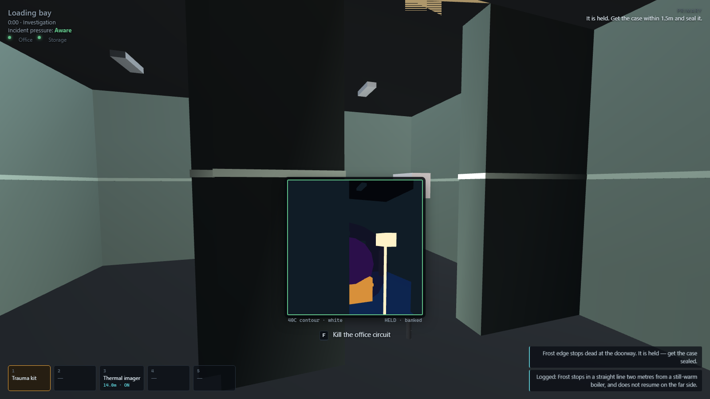

# Containment Detail — the browser build

**Play it: https://dumb-tony.github.io/ContainmentDetailWeb/**

A first-person containment operation. You are a Foundation field unit sent two levels
down into a cold store where a maintenance crew reported *"cold that moves"*. Two of the
three came back.

You do not kill it. You work out what it wants, build something that stops it, and put it
in a box while it is still trying to get past you.



## What is actually going on

One scalar field, sampled. `heat.temperatureAt(x, z)` is what the thermal imager paints,
what the anomaly's path test reads, and what decides whether a fence holds — there is no
second source of truth for either of them to drift from. Everything the game does falls
out of that one function and the anomaly's own rule: **it cannot cross a sustained heat
gradient above 40°C.**

- A **floodlight tripod** is a fence post because its own 40°C contour blocks the approach
  to itself. Nothing in the code special-cases "ignore floodlights" — it just cannot get
  there.
- The **transit case** runs its heater at 39°C. One degree under the threshold, two above
  a human being: it is the warmest thing on the floor the draught can still reach, so it
  is bait rather than a wall. Set a tripod down too close to it and the bait becomes a
  wall, and nothing comes.
- Heat sources **superpose**, so two tripods bridge a 4.2 m aisle that neither can span
  alone. The measured contour radii are printed by the test suite rather than remembered.
- The draught is a **cold mass**: it lowers the wall it leans on. A fence that was exactly
  good enough on the way in is not good enough at contact.
- The floor gets **colder** the longer you take, and a colder floor shrinks every contour
  you own. That is the clock, and you can feel it.

Two kinds of wall exist and they are different lists. Cold-store panel and closed freight
doors stop the draught; the steel racking in the aisles does not, and neither does
anything else you might reasonably expect to. That asymmetry is why the site's two-step
power puzzle matters — the office breaker is out on the bay wall, the storage breaker is
*inside the office*, and the freight door they bring up is the lane your lure needs.

The mission ends when the case is sealed, has held for thirty seconds, and is carried up
the stairs. It can be lost at any point in that sentence.

## Two incidents, one floor

The content unit is an **Incident Package**, not a map — an anomaly file holds rules and
nothing about where; a map holds geometry and nothing about what happened;
`content/incidents/` binds them and carries the spawn, the evidence lying about, and the
briefing. That is the only reason two operations can share a building.

**Cold that moves.** The graybox-draught: an invisible cold mass that hunts the warmest
thing it can reach and cannot cross a sustained 40 °C gradient. You fence it, bait it with
a case running one degree under the threshold, and seal it while it is held.

**The figure in aisle B.** The stillwater-figure does not move while it is observed. That
is the entire rule and the entire containment: you never fence it, you never stop looking
at it, and the difficulty is that looking is a resource you also need for carrying,
placing, powering and sealing. It reads at ambient on thermal, the breakers are
irrelevant, and its own capability browns out the cameras holding it — the fence you built
is the thing it feeds on.

A squad that arrives with the first playbook finds every instinct wrong. That is the point
(GDD §15.2: the building is the constant, the incident is the variable).

**The engine does not know what either of them is called.** States, triggers, capabilities
and field disturbance are all read from content, through a closed vocabulary of senses and
effect verbs in `src/sim/senses.js`. A JSON key may name a *quantity*, never an *operator*.
The suite proves it by renaming every state in the shipped anomaly to `q0`–`q4` and running
the whole sequence through anyway.

## The site

Between operations you are at Regional Site 19: a mission board, an armory counter, an
archive, a research station and a containment corridor that lists what you are holding by
its operational history rather than as a trophy. Progression grants **options, context and
efficiency** — never damage, never immunity (GDD §12.1). Equipment upgrades are sidegrades;
a new variant never makes the old tool irrelevant.

Failure is recoverable and never profitable. A failed operation still yields research for
valid observations, and the site can always fund one more attempt — but leaving your kit on
the floor costs you, with the departments that care about kit.

## Accessibility

Full remapping with browser-reserved keys refused, hold-vs-toggle resolved at the source,
captions for every audio cue, colour-vision presets with shape redundancy, adjustable
FOV/shake/bob/blur/grain/distortion, photosensitivity-safe mode that clamps rather than
recording a preference, five volume sliders, UI scale, and difficulty assists. `O` opens it.

GDD §19.2 is the design constraint, not the menu: no required rule may depend on fine
colour discrimination, stereo hearing, a microphone, small text or flashing imagery.

## One to five operatives

Host a room, share the five-character code, and everyone connects browser to browser over
WebRTC. No account, no server, no lobby list. A public broker introduces the two machines
and then carries nothing — every command and every snapshot goes peer to peer.

**The host's browser is the mission.** A client sends intent and draws snapshots and steps
nothing at all, so it cannot disagree about whether custody was established. It predicts
its own feet for responsiveness and blends toward the host's answer; past 1.2 m it snaps,
because smoothing that far is a slow lie. A client that teleports itself is simply
overwritten on the next snapshot.

A second operative changes the simulation, not just the roster:

- **Every one of them is a heat source**, so a squad is several lures. The draught takes
  whichever it can actually reach — not whoever happens to be player one.
- **A second serious contact puts you down, not dead**, on a ninety-second clock. A
  teammate with a trauma kit gets the rescue prompt above everything but the seal. Alone,
  nobody comes.
- **A tripod is a long item**, so each of you carries one at a time. A fence that takes
  three trips solo takes one with three people.
- **Two on the case** move it at 95% pace; one drags it at 75%. Never gated — solo works.
- Somebody can watch the imager while somebody else has both hands full. There is one
  imager in the cargo budget, so that is a decision.

Joining is open until the squad commits to a procedure. After that the operation is
running and the door is shut. Lose your connection and your seat is held: your kit stays
yours, your operative stands still rather than wandering off, and a resume token puts you
back in the same body. If you were carrying custody when your radio died, the case is set
down where you stood rather than leaving the floor with you.

## Controls

| | |
|---|---|
| `W A S D` | move · `Shift` sprint · `Ctrl` crouch |
| `F` | the context verb — it says what it will do before you press it |
| `E` | use or deploy what is in hand |
| `1`–`5` | select a slot |
| `Q` | thermal imager on/off |
| `Tab` | field tablet: evidence log, hypothesis board, procedure planner |
| `Esc` | release the mouse |

Click the page to take the mouse. Two belt slots, two general, one long — a floodlight
tripod is the only thing that fits the long slot, so you carry them one at a time and the
walk back to the vehicle is part of the wager.

## Running it locally

Serving over http is required, not a convenience: the game is ES modules and browsers
refuse module loads on `file://`.

```bash
powershell -ExecutionPolicy Bypass -File tools/serve.ps1
```

It scans ports 8401–8410 and prints the one it got. Read that line — several projects on
this machine run the same server.

## Tests

There is no Node.js here, so the harness is a browser.

```bash
powershell -ExecutionPolicy Bypass -File tools/smoketest.ps1 -Tests tools/m0-tests.js
```

**298 assertions, all headless.** Section I is the one that matters: it plays a complete
solo containment through the same interfaces a keyboard reaches — walks to the vehicle,
takes kit, throws breakers, opens doors, baits, fences, seals, waits out custody and
carries the case to the stairs. No teleports and no direct state writes, because testing
the simulation is not testing the game. Sections C and E print measured numbers rather
than asserting remembered ones.

Section M runs a whole three-operative session through the real encode/decode over a
loopback link — join, intent, snapshot, refusal, the squad cap, a version mismatch, a
drop, a reconnect, the join gate, custody being put down rather than carried offline by
somebody whose radio died — with no WebRTC in sight. What a loopback *cannot* prove was
checked in two real browsers on the real broker, and that is where the notice-feed bug
was found: a refusal the host sent and the client's next snapshot destroyed.

`tools/shot.ps1 -Setup tools/_shot-fence.js -Out docs/m0-fence.png` poses a scene and
photographs it.

## Structure

```
index.html            the page; loads the vendored r128 and src/main.js
GAME_BIBLE/GDD.md     the design authority, imported verbatim
content/              incidents, anomalies, maps, equipment and the site — all validated JSON
src/sim/              the rules. No renderer, no DOM, no wall clock — enforced by the suite
src/net/              protocol.js is pure; net.js is the only file that touches Peer
src/ui/settings.js    the accessibility model (DOM-free) and its panel
src/render/           three.js: the eye's view, and the imager's second pass
src/ui/               HUD and panels, plain DOM
tools/                dev server, headless test harness, screenshot harness
```

**`src/sim/` does not know there is a renderer.** That is the Unity build's central rule
carried over, and it is what lets the suite drive an entire containment with no canvas.
Section K greps for violations rather than trusting anyone to remember.

## Relationship to the Unity build

[`Dumb-Tony/ContainmentDetail`](https://github.com/Dumb-Tony/ContainmentDetail) is the
same game in Unity, and it is not going anywhere. This is a second implementation of the
same design bible, in the browser, so the loop can be played in one click.

The design bible, the anomaly, the map and the equipment manifest are **imported from that
repo**, not re-invented — `graybox-draught.json` here is its content file, extended with
the fields this build's simulation reads. Where the two disagree, the GDD is the authority
and the disagreement is a bug in one of them.

## Licensing

The anomaly is deliberately **original, not an SCP** — `licensingRecordId: null`. GDD §25
makes an attribution record a prerequisite for implementing any SCP-derived content, and
the open questions in §25.7 about how ShareAlike applies to game code are not settled. The
whole discovery-to-custody loop can be built and tested while that stays open, and it has
been.

Third-party code is vendored and credited in [`assets/lib/NOTICE.md`](assets/lib/NOTICE.md).

A solo operation makes **zero external requests**. Hosting or joining contacts exactly one
network host — a signalling broker that introduces two browsers and then carries no game
traffic. That exception lives in one named file, and the suite asserts it rather than
letting it pass by accident: section K fails if any *other* source file grows a hostname.
